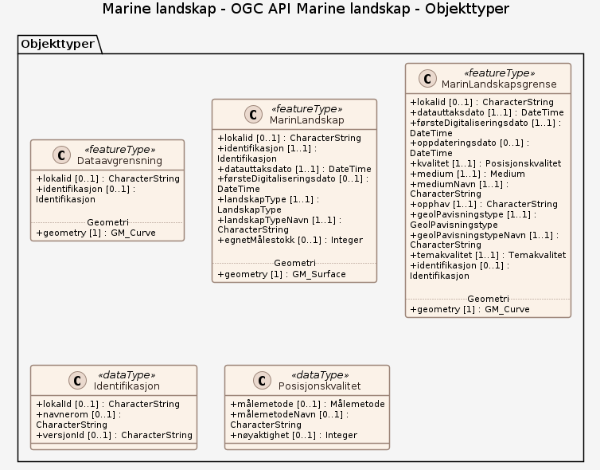
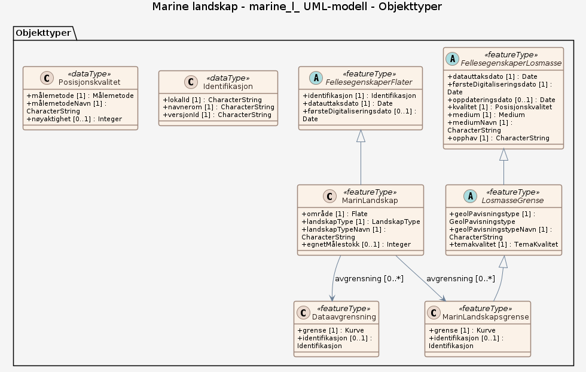

# Produktspesifikasjon: Marine landskap

*Datasettet viser en inndeling av havområdene i ulike marine landskap, definert som større geografiske områder med enhetlig visuelt preg. Marin landskapskartlegging går ut på å beskrive de store trekkene i topografien på havbunnen. Klassifiseringen som er gjort her, bygger på Naturtyper i Norge. Klassifiseringen er basert på batymetri med 50 meters oppløsning.*

**Nøkkelord:** hav, havbunn, marin, sjøbunn, natur, strandflate, kontinentalskråning, terrengform, terreng, marin dal, fjord, dyphavsslette, kontinentalsokkelslette, grunnmarin dal, marint fjell-landskap, øy- og sundlandskap, landskap, Marint gjel, Nedskåret fjord, Norge, Barentshavet, Norskehavet, Nordsjøen, Grønlandshavet, Havområder, Inspire, Norge digitalt, geodataloven, Mareano, modellbaserteVegprosjekter, fellesDatakatalog, NGU, NiN, Naturtyper i Norge, MarinLandskapsgrense, MarinLandskap, landskapType

**Emnekategorier:** Geovitenskapelig informasjon

**Tidsmessig utstrekning**:

- **Tidsperiode**:
  - **Fra**: 2010-01-15
  - **Til**: 2022-11-11

## Om spesifikasjonen

> **Denne versjonen av produktspesifikasjonen:**  
> **Opprettet dato:** 2010-01-15 
> **Endret dato:** 2022-11-11 
> **Språk:** nor 
> **Kontaktinformasjon:** Norges geologiske undersøkelse, [sigrid.elvenes@ngu.no](mailto:sigrid.elvenes@ngu.no)

## Om produktet Marine landskap

> **Romlig representasjonstype:** Vektor 
> **Unik identifikator:** <https://data.geonorge.no/sosi/geologi/marine_landskap> 
> **Kontaktinformasjon:** Norges geologiske undersøkelse, [sigrid.elvenes@ngu.no](mailto:sigrid.elvenes@ngu.no)
>
> **Romlig oppløsning:**
>
> **Ekvivalent målestokk**: 2000000
>
> **Begrensninger:**
>
> **Ressursbegrensninger**:
>
> - **Bruksbegrensninger**: Detaljnivået på datasettet tilsier bruk innenfor kartmålestokken: 1:500.000 - 1:3000.000
>
> **Juridiske begrensninger**:
>
> - **Tilgangsbegrensninger**: Åpne data
> - **Bruksbegrensninger**: Lisens
> - **Lisens**: Norsk lisens for offentlige data (NLOD)
> - **Lisenslenke**: <http://data.norge.no/nlod/no/1.0>
>
> **Sikkerhetsbegrensninger**:
>
> - **Klassifisering**: Ugradert

### Formål

Marin landskapskartlegging går ut på å vise de store trekkene i topografien på havbunnen. Landskapskart inngår som en del av naturtypekartleggingen i Norge. Gode naturtypekart er en forutsetning for å kunne lage helhetlige planer for bruk og vern av natur.

### Bruksområde

Landskapskart inngår som en del av naturtypekartleggingen i Norge. Gode naturtypekart er en forutsetning for å kunne lage helhetlige planer for bruk og vern av natur. Kart over marine landskap kan også anvendes som underlag i overordnet areal- og miljøplanlegging, sårbarhetsanalyser, habitatskartlegging og så videre, eller som geomorfologiske oversiktskart.

## Omfang

### Hele datasettet

**Nivå**: dataset

**Nivåbeskrivelse**: Gjelder hele datasettet. Hvis omfang ikke er oppgitt under en overskrift, gjelder teksten for hele datasettet og alle leveranser

### OGC API Marine landskap

**Nivå**: dataset

**Nivåbeskrivelse**: OGC API – Features (koblet til datasettet i Geonorge)

### marine_l_ UML-modell

**Nivå**: dataset

## Datainnhold og struktur

### Datamodell - OGC API Marine landskap

➡️ [Se full datamodell for omfang "OGC API Marine landskap" (diagram per pakke og objektkatalog)](ogc-api-marine-landskap/objektkatalog.html)

### Datamodell - marine_l_ UML-modell

➡️ [Se full datamodell for omfang "marine_l_ UML-modell" (diagram per pakke og objektkatalog)](marine-l-uml-modell/objektkatalog.html)

## Referansesystem

| EPSG-kode | Navn på referansesystem |
| --- | --- |
| [EPSG:25832](https://epsg.io/25832) | [EUREF89 UTM sone 32, 2d](https://register.geonorge.no/epsg-koder) |
| [EPSG:25833](https://epsg.io/25833) | [EUREF89 UTM sone 33, 2d](https://register.geonorge.no/epsg-koder) |
| [EPSG:25835](https://epsg.io/25835) | [EUREF89 UTM sone 35, 2d](https://register.geonorge.no/epsg-koder) |
| [EPSG:32632](https://epsg.io/32632) | [WGS84 UTM sone 32, 2d](https://register.geonorge.no/epsg-koder) |
| [EPSG:32633](https://epsg.io/32633) | [WGS84 UTM sone 33, 2d](https://register.geonorge.no/epsg-koder) |
| [EPSG:32635](https://epsg.io/32635) | [WGS84 UTM sone 35, 2d](https://register.geonorge.no/epsg-koder) |
| [EPSG:4326](https://epsg.io/4326) | [WGS84 Geografisk](https://register.geonorge.no/epsg-koder) |

## Datakvalitet

**Nivå**: dataset

**Kvalitetsmål**: COMMISSION REGULATION (EU) No 1089/2010 of 23 November 2010 implementing Directive 2007/2/EC of the European Parliament and of the Council as regards interoperability of spatial data sets and services

- **Beskrivende resultat**: Dataene er ikke vurdert iht produktspesifikasjonen

**Kvalitetsmål**: SOSI produktspesifikasjon: Marine landskap

- **Beskrivende resultat**: Dataene er i henhold til produktspesifikasjonen

**Kvalitetsmål**: Sosi applikasjonsskjema

- **Beskrivende resultat**: SOSI-filer er i henhold til applikasjonsskjema

**Kvalitetsmål**: Sosi applikasjonsskjema

- **Beskrivende resultat**: GML-filer er ikke vurdert i henhold til applikasjonsskjema

**Kvalitetsmål**: Prosentvis oppfyllelse av FAIR-prinsipper

- **Målebeskrivelse**: Angir fullstendighet i forhold til krav fra FAIR-prinsippene (The FAIR Guiding Principles for scientific data management and stewardship)
- **Resultat**: 98

## Datafangst og produksjon

**Datainnsamling og prosessering**:

- **Prosesstrinn**:
  - **Beskrivelse**: Datasettet er tolket og digitalisert av NGU, men grunnlaget for tolkningene er data fra Norges geologiske undersøkelse, Statens kartverk, Olex, Forsvarets Forskningsinstitutt og IBCAO. Klassifiseringen av Marine landskaper bygger på Naturtyper i Norge. Datagrunnlaget for tolkningen er batymetridata med 50-500 meters oppløsning. Dybdedataene er bearbeidet og analysert med ESRI Spatial Analyst-verktøy. Datasettet Marine landskap i vektorformat er digitalisert og tilrettelagt vha. ArcGIS-verktøy. Metodikken er beskrevet i egenskapsfeltene Målemetode og GeolPavisningstype.

## Vedlikehold

**Vedlikeholdsfrekvens**: Etter behov

**Status**: Fullført

## Presentasjon

**navn**: Tegneregler

**Lenke**:
<https://register.geonorge.no/register/versjoner/tegneregler/norges-geologiske-undersøkelse/marine-landskap>

## Leveranse

| Tjeneste | Endepunkt | Type | Format | Leveranseenheter |
| --- | --- | --- | --- | --- |
| Egen nedlastningsside | [Lenke](https://geo.ngu.no/download/order?dataset=705) | WWW:DOWNLOAD-1.0-http--download | FGDB, GML, SOSI |  |
| Geonorge nedlastning | [Lenke](https://nedlasting.ngu.no/api/capabilities/) | GEONORGE:DOWNLOAD | FGDB, GML, SOSI |  |
| Atom Feed | [Lenke](https://nedlasting.ngu.no/api/atom/9db56b4f-474a-4e79-bd87-a2f0e4e4728e) | W3C:AtomFeed | FGDB, GML, SOSI |  |
| Marine landskap | [Lenke](http://geo.ngu.no/mapserver/MarinLandskapWMS?REQUEST=GetCapabilities&SERVICE=WMS) | Tjenestelag | OGC/WMS |  |
| Marine landskap WMS | [Lenke](https://geo.ngu.no/mapserver/MarinLandskapWMS?REQUEST=GetCapabilities&SERVICE=WMS) | WMS-tjeneste | png |  |
| GeoPackage: marine-l-uml-modell | [Lenke](https://raw.githubusercontent.com/larsingea/ps_test2/main/produktspesifikasjon/marine-landskap/marine-l-uml-modell/marine-l-uml-modell.gpkg) | Nedlasting | GPKG |  |
| GeoPackage: ogc-api-marine-landskap | [Lenke](https://raw.githubusercontent.com/larsingea/ps_test2/main/produktspesifikasjon/marine-landskap/ogc-api-marine-landskap/ogc-api-marine-landskap.gpkg) | Nedlasting | GPKG |  |
| GML/XSD-skjema: marine-l-uml-modell | [Lenke](https://raw.githubusercontent.com/larsingea/ps_test2/main/produktspesifikasjon/marine-landskap/marine-l-uml-modell/schema/xsd/INPUT/marine-l-uml-modell.xsd) | Nedlasting | XSD |  |
| GML/XSD-skjema: ogc-api-marine-landskap | [Lenke](https://raw.githubusercontent.com/larsingea/ps_test2/main/produktspesifikasjon/marine-landskap/ogc-api-marine-landskap/schema/xsd/INPUT/ogc-api-marine-landskap.xsd) | Nedlasting | XSD |  |
| JSON Schema: marine-l-uml-modell | [Lenke](https://raw.githubusercontent.com/larsingea/ps_test2/main/produktspesifikasjon/marine-landskap/marine-l-uml-modell/schema/jsonschema/INPUT/marinelumlmodell/marine-l-uml-modell.json) | Nedlasting | JSON Schema |  |
| JSON Schema: ogc-api-marine-landskap | [Lenke](https://raw.githubusercontent.com/larsingea/ps_test2/main/produktspesifikasjon/marine-landskap/ogc-api-marine-landskap/schema/jsonschema/INPUT/ogcapimarinelandskap/ogc-api-marine-landskap.json) | Nedlasting | JSON Schema |  |

## Metadata

**Metadatastandard**: ISO19115

**Metadatastandardversjon**: 2003

**Metadatadato**: 2026-09-17

**språk**: nor

**Kontakt**:

- **Organisasjon**: Norges geologiske undersøkelse
- **Kontaktperson**: Janne Grete Wesche
- **Logo**: <https://register.geonorge.no/data/organizations/970188290_NGU_hovedlogo_svart.svg> thumbnail.png
- **Epost**: metadataansvarlig@ngu.no
- **rolle**: pointOfContact

**Metadataidentifikator**:

- **Utsteder**: Geonorge
- **kode**: 9db56b4f-474a-4e79-bd87-a2f0e4e4728e
- **koderom**: <https://kartkatalog.geonorge.no/metadata/>
- **Metadatalenke**: <https://kartkatalog.geonorge.no/metadata/9db56b4f-474a-4e79-bd87-a2f0e4e4728e>

## Tilleggsinformasjon

- **Produktark:** [https://register.geonorge.no/register/versjoner/produktark/norges-geologiske-undersøkelse/marine-landskap](https://register.geonorge.no/register/versjoner/produktark/norges-geologiske-undersøkelse/marine-landskap)
- **Produktside:** [http://www.ngu.no/emne/marine-landskap](http://www.ngu.no/emne/marine-landskap)
